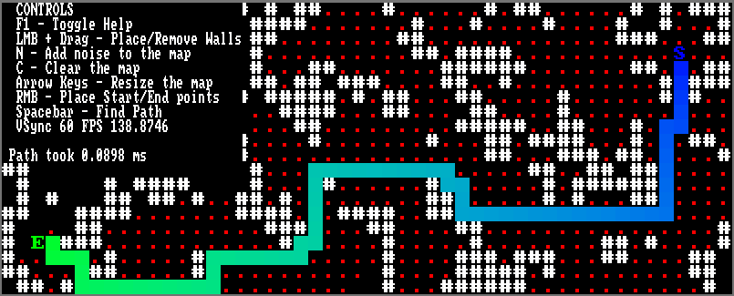
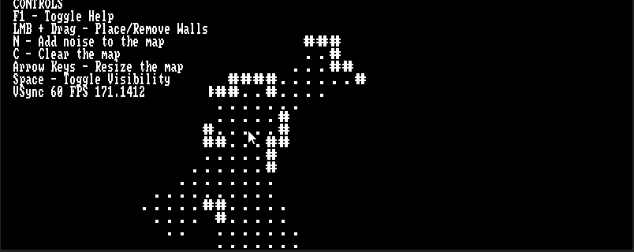
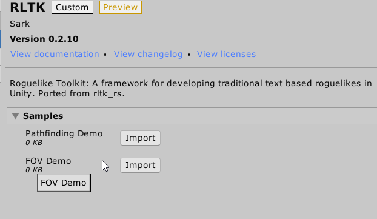

# The Roguelike Toolkit (RLTK) for Unity

RLTK is a set of tools used for building pixel perfect ascii-based roguelikes in Unity. The tools are separated into a few individual packages, while this package uses all those separate tools to host a few demos showing off them off.

This framework was originally based on [The Roguelike Toolkit (RLTK), implemented for Rust](https://github.com/thebracket/rltk_rs) by TheBracket.

##### The Individual Packages:
* __Pathfinding__: [Github](https://github.com/sarkahn/pathfinding) - [OpenUPM](https://openupm.com/packages/com.sark.pathfinding/) - A simple generic pathfinding solution that's usable in jobs and burst.
* __Terminals__: [Github](https://github.com/sarkahn/terminals) - [OpenUPM](https://openupm.com/packages/com.sark.terminals/) - A set of terminals used for rendering pixel perfect ascii terminals in Unity.
* __Tiled Camera__: [Github](https://github.com/sarkahn/tiledcamera) - [OpenUPM](https://openupm.com/packages/com.sark.tiled_camera/) - A camera utility for defining your pixel perfect viewport in terms of tiles.
* __Common__: [Github](https://github.com/sarkahn/common) - [OpenUPM](https://openupm.com/packages/com.sark.common/) - Common utilities I use in various places.

## Demos

##### Pathfinding 


*Demonstrates the pathfinding library using an interactive terminal*

##### FOV


*Demonstrates the FOV algorithm using an interactive terminal*

------

The RLTK demos can be imported from the package manager:



------

##### Roguelike Tutorial

In addition to the above samples included in this package, I am [developing a Roguelike that uses RLTK as a backend](https://github.com/sarkahn/rltk_unity_roguelike), based on the excellent [Roguelike Tutorial in Rust](https://bfnightly.bracketproductions.com/rustbook/chapter_1.html). It's being developed using Unity's ECS framework and should be of interest to anyone who would want to know how to actually make a game using RLTK.

## How to Install
 
##### Via [OpenUPM](https://openupm.com/):
```
npm install -g openupm-cli
openupm add com.sark.rltk_unity
```

*This will automatically install required dependencies*

---
RLTK for Unity will always be free and the code will always be open source. With that being said I put quite a lot of work into it. If you find it useful, please consider donating. Any amount you can spare would really help me out a great deal - thank you!

[](https://www.paypal.com/cgi-bin/webscr?cmd=_s-xclick&hosted_button_id=Y54CX7AXFKQXG)