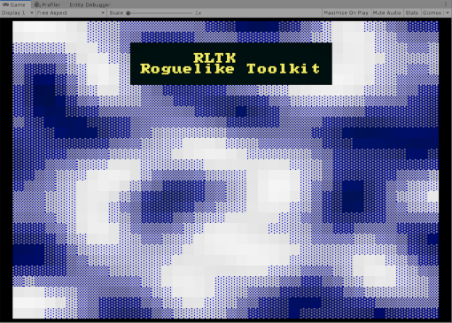

# RLTK for Unity

This is a framework built specifically for creating roguelikes and rendering ascii efficiently and without artifacts inside Unity. While the API is made to be as simple and straightforward as possible, internally it utilizes Unity's Job system and Burst compiler to achieve great performance and avoid any memory allocations whenever possible.

This was developed in Unity version 2019.3.06f.

This code is based off [The Roguelike Toolkit (RLTK), implemented for Rust](https://github.com/thebracket/rltk_rs).

RLTK for Unity will always be free and the code will always be open source. With that being said I put quite a lot of work into it. If you find it useful, please consider donating. Any amount you can spare would really help me out a great deal - thank you!

 
## The Samples

The samples demonstrate how to properly set up and write to a console.

##### Samples/Noise 

##### Samples/ShaderExample

## The Consoles

There are three primary console types, `SimpleConsole`, `NativeConsole` and `SimpleConsoleProxy`:

##### [SimpleConsole](Assets/Runtime/RLTK/Consoles/SimpleConsole.cs) - Usage is demonstrated in the "ManualDraw" sample.
  * Provides a straightforward API for writing text to a console.
  * **NOT** a MonoBehaviour, you must construct and use it directly from code.
  * Must manually call `Draw()` and `Update()` every frame to render it.
  * Must call manually `Dispose()` before it goes out of scope to free internal [unmanaged memory](https://docs.unity3d.com/ScriptReference/Unity.Collections.NativeArray_1.html).

 

##### [NativeConsole](Assets/Runtime/RLTK/Consoles/NativeConsole.cs) - Usage is demonstrated in the "Noise" sample.
  * Derived from `SimpleConsole`, provides a few more advanced functions for those familiar with Unity's [job system](https://docs.unity3d.com/2019.3/Documentation/Manual/JobSystem.html).
  * Same rules for `Draw()` and `Dispose()`.

##### [SimpleConsoleProxy](Assets/Runtime/RLTK/MonoBehaviours/SimpleConsoleProxy.cs) - Usage is demonstrated in the "Hello World" sample.
  * A MonoBehaviour wrapped around a `SimpleConsole`. Allows you to easily reference and write to a console from other MonoBehaviours.
  * Console properties can be tweaked from the inspector.
  * No need to call `Dispose()` or `Draw()`. 
  * Can be set up automatically using the menu option `GameObject/RLTK/Initialize Simple Console`.

**IMPORTANT**: In order to avoid rendering artifacts you must make sure to keep the console position locked to the pixel grid (origin works) and have the viewport and camera set up properly. An easy way to automatically set up the camera is directly from code with a single function call to [RenderUtility.AdjustCameraToConsole](Assets/Runtime/RLTK/Rendering/RenderUtility.cs#L112).

If you're using SimpleConsoleProxy you can use the [LockCameraToConsole](Assets/Runtime/RLTK/Monobehaviours/LockCameraToConsole.cs) MonoBehaviour instead.

## What does it do
* You can write to the console with the `Set` and `Print` functions, or retrieve the native tiles from the console for use directly inside jobs. Consoles are fast enough to clear and draw a large number of tiles every frame, the way you would in a traditional roguelike. 
* There are field of view functions in the `FOV` class.

## How to use it

For examples of how to use the different parts of the framework consoles check the [samples](https://github.com/sarkahn/rltk_unity/tree/master/Assets/Samples) and [tests](https://github.com/sarkahn/rltk_unity/tree/master/Assets/Tests/Editor).

Along with RLTK I am [developing a Roguelike that uses RLTK as a backend](https://github.com/sarkahn/rltk_unity_roguelike), based on the excellent [The Roguelike Tutorial in Rust](https://bfnightly.bracketproductions.com/rustbook/chapter_1.html). It's being developed using Unity's ECS framework and should be of interest to anyone who would want to know how to actually make a game using RLTK.

## How to get it
The recommended way to use this package is via the Unity Package Manager. At the top left 
of the package manager, click the "+" button and choose "Add package from git url...". 
Then paste in `https://github.com/sarkahn/rltk_unity.git#upm`
and you should be good to go.

This will automatically install the package and all required dependencies. **You can import 
the built in samples from the package manager UI once it's installed**.

If you need to update RLTK you can remove and re-install it via the package manager or delete 
this section from the "Packages/manifest.json" file in your project root folder:

That will cause the package manager to automatically update to the latest version.

